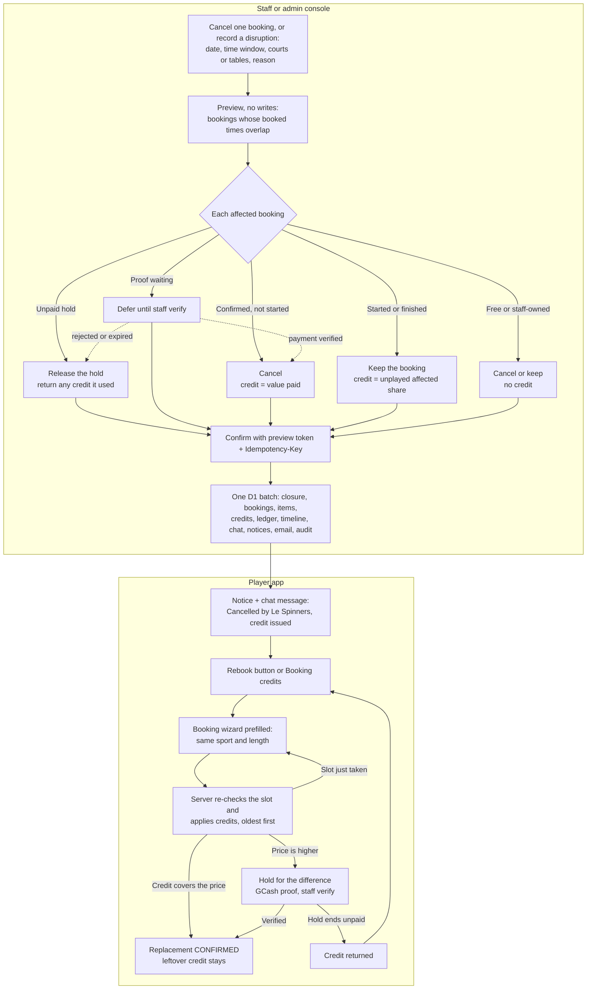
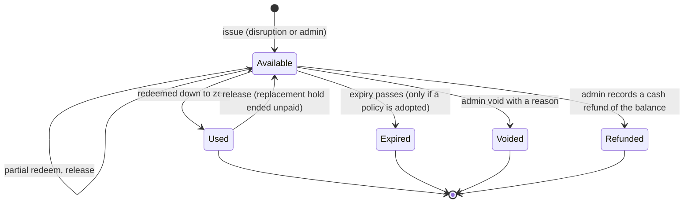

# Booking disruption, rebooking and booking credits

**Status:** implemented on 2026-10-02 (branch `feature/rebooking-credits`): phases 0–3 in full and
most of phase 4 ([§17](#17-implementation-phases) lists what is and isn't built). Where a
business-policy question in [§18](#18-business-policy-decisions) is still open, the implementation
uses the default marked ⚙ there; each one can change later without a schema change.

Code references name files and functions, not line numbers, so they survive edits.

Contents: [1 Summary](#1-executive-summary) ·
[2 Existing architecture](#2-existing-architecture-and-relevant-code-paths) ·
[3 Current workflow](#3-current-booking-and-payment-workflow) ·
[4 Lifecycle](#4-proposed-cancellation-and-disruption-lifecycle) ·
[5 Credit model](#5-recommended-rebooking-and-credit-model) ·
[6 Algorithms](#6-algorithms) · [7 Worked examples](#7-worked-examples) ·
[8 State transitions](#8-state-transitions) · [9 Database](#9-database-changes-and-migration-strategy) ·
[10 API](#10-api-and-authorization) · [11 Staff console](#11-staff-and-admin-console) ·
[12 Player app](#12-player-app-and-rebooking-experience) ·
[13 Notifications & audit](#13-notifications-and-audit) ·
[14 Concurrency](#14-concurrency-idempotency-rollback-and-recovery) ·
[15 Security](#15-security-and-abuse-prevention) · [16 Tests](#16-tests-and-acceptance-criteria) ·
[17 Phases](#17-implementation-phases) · [18 Decisions](#18-business-policy-decisions)

---

## 1. Executive summary

- **What exists.** Bookings move through seven server-controlled statuses. A booking can hold
  several slots with gaps (`booking_slots`, `booking_times`). Double booking is prevented by an
  atomic `INSERT … WHERE NOT EXISTS`. GCash proofs are verified by staff with a mandatory
  "amount on the screenshot equals the amount due" checklist. Closures, maintenance and open play
  show an affected-bookings preview but **never touch bookings**. In-app notices, booking chat,
  an email outbox, an audit log and cash-basis revenue reporting are in place.
- **Customers already cannot cancel on the server.** `POST /api/bookings/:id/cancel` always
  answers `409 NOT_CANCELLABLE`. But dead player-side cancel UI remains, the spec and
  DESIGN_MEMORY still describe "player cancels 24 h ahead", and players can release their own
  *unpaid* holds.
- **The gap.** Nobody can cancel a paid or confirmed booking: `staffCancel` only cancels unpaid
  holds. A closure over a confirmed booking leaves it `CONFIRMED`, compensation is promised
  informally in chat, and Revenue reports such bookings as "refund not recorded". There is no
  credit, refund or replacement-booking record.
- **Recommended model (Option C).** One **booking credit** per disrupted booking, holding a peso
  value computed from what the player actually paid (`amount_due + credit_applied` of a verified
  booking), plus an append-only credit ledger. Players see one total and where each credit came
  from. Credits are applied automatically at checkout, soonest-expiring first, and the server
  computes every amount.
- **One engine for one booking or a whole closure.** Plan (pure computation over `booking_times`
  overlap) → staff preview → confirm. Per booking: unpaid hold → released (any credit it used is
  returned); proof waiting → deferred until verified; confirmed and not started → cancelled with
  credit = value paid; started or finished → kept, credit = the unplayed affected share; free or
  staff-owned bookings → no credit.
- **Integrity on Workers Free.** Each confirmation is **one D1 batch** of about 16 set-based
  statements (one transaction), whatever the number of bookings. Every booking carries an
  optimistic version check, every confirmation an idempotency key, and the credit balance is
  recomputed from the ledger with `CHECK (remaining >= 0)` so a double redemption rolls back.
- **Schema.** Additive migration `0007`: `disruptions`, `disruption_items`, `booking_credits`,
  `credit_transactions`; `bookings.credit_applied`, `compensated_amount`, `disruption_id`;
  `closures.disruption_id`. No table rebuild, no new booking status, no new payment method.
- **Phases.** 0 groundwork → 1 disruption engine and credit issuance → 2 redemption when the
  credit covers the price → 3 credit + GCash top-up → 4 admin credit tools and reporting →
  5 optional (move to another court, staff-assisted rebooking).

## 2. Existing architecture and relevant code paths

One Cloudflare Worker (Hono, TypeScript) serves the API and the static PWA; D1 holds the data,
a private R2 bucket the payment screenshots, and a one-minute cron runs time-driven work. The
frontend is vanilla ES modules. The deployment runs on the Workers **Free** plan.

Labels: **Implemented** · **Partial** · **Missing** · **Verify** (requires verification).

| Area | Finding | Label |
|---|---|---|
| Roles | `users.role` ∈ `player`, `staff`, `admin`. `requirePlayer` / `requireStaff` / `requireAdmin` in [src/worker/lib/auth.ts](src/worker/lib/auth.ts). One operations router is mounted at `/api/staff/*` (staff + admin) and `/api/admin/*` (admin) in [src/worker/index.ts](src/worker/index.ts); settings, prices, the outbox and revenue are admin-only. | Implemented |
| Membership and pricing | Per-resource `price_member` / `price_non_member` per slot. The rate is locked on the booking (`bookings.rate`, `amount_due = price × slots`, `createHold`). Membership `pending` pays the non-member rate. No discounts, fees or peak pricing. | Implemented; fees/discounts Missing |
| Schedules | One facility-wide weekly schedule (`opening_hours`); per-court variation only through closures, maintenance and open play. | Partial |
| Booking statuses | Seven values under a `CHECK` constraint in [migrations/0001_init.sql](migrations/0001_init.sql); `effectiveStatus` expires lapsed holds lazily. | Implemented |
| Multi-slot bookings | `booking_slots` + the `booking_times` view ([migrations/0005_booking_slots.sql](migrations/0005_booking_slots.sql)); overlap checks read segments, not the span. | Implemented |
| Double booking | `insertBooking` / `clashSql` in [src/worker/lib/bookings.ts](src/worker/lib/bookings.ts): one atomic `INSERT … WHERE NOT EXISTS` over `booking_times`, plus a partial unique index. | Implemented |
| Closure check at insert | `checkSlots` reads closures *before* the atomic insert, so a booking can slip into a window closed a moment earlier. Maintenance/open-play status is read the same way. | Partial (race) |
| Payment | GCash screenshot → `PAYMENT_SUBMITTED` → staff approve (checklist item "Amount on the screenshot equals the amount due", [public/js/admin/screens/verify.js](public/js/admin/screens/verify.js)) → `CONFIRMED`; reject with an optional resubmit window ([src/worker/lib/payments.ts](src/worker/lib/payments.ts)). Console bookings: `on_site` (paid at the desk) or `none` (free), always owned by the staff account (`createConsoleBooking`). | Implemented |
| Partial payment | Not supported; an underpayment must be rejected. | Missing (by design) |
| Customer cancellation | `cancelByPlayer` always throws `409 NOT_CANCELLABLE`; the DTO says `canCancel: false`; smoke-tested in "No cancellation once booked or paid". | Implemented |
| Player cancel UI | `openCancel()` and `cancelledView` ("Cancelled · By you") in [public/js/player/screens/booking.js](public/js/player/screens/booking.js) are wired but unreachable; the bookings list says "If you cancel a booking…". | Partial (dead code, misleading copy) |
| Hold release | Players release their own `TEMPORARY` / `REJECTED` hold → `CANCELLED` "Released by player" (`releaseHold`). | Implemented (kept, see §18) |
| Operator cancellation | `staffCancel` cancels unpaid holds only; paid or confirmed → `409`. The staff UI offers Cancel only for holds. | Missing for paid/confirmed bookings |
| Closures, maintenance, open play | `affectedBookings` + `requireConfirmation` ([src/worker/lib/facility.ts](src/worker/lib/facility.ts)) answer `409 AFFECTS_BOOKINGS` until every affected booking is confirmed; "Nothing is cancelled or rewritten automatically". Closures can't be created for past dates. UI loop: `withImpactCheck` in [public/js/admin/impact.js](public/js/admin/impact.js). | Partial (no cancellation or compensation) |
| "Move to Court N" | Drawn in the admin mock next to "Cancel & notify"; not built (DESIGN_MEMORY §16). | Missing |
| Notifications | `notifications` (player inbox and shared staff centre), booking-chat system messages, `outbox` email sent through Resend when configured, SMS queued only ([src/worker/lib/notify.ts](src/worker/lib/notify.ts)). No push. | Implemented; production email delivery **Verify** |
| Support / contact | One private chat per booking; all copy says "message staff in the booking chat". | Implemented |
| Guarded batches | `Guard` + `changedAt()` make side effects conditional on the status change in the same batch. | Implemented (reused) |
| Cron | Every minute: expire holds, send warnings, complete past bookings, flush the outbox; hourly housekeeping ([src/worker/lib/maintenance.ts](src/worker/lib/maintenance.ts)). | Implemented |
| Revenue | Cash basis at `confirmed_at`; "cancelled after payment" is excluded and labelled "refund not recorded" because the schema has no refund record ([src/worker/routes/revenue.ts](src/worker/routes/revenue.ts)). | Partial |
| Refunds, credits, replacement links | None. The cancelled-booking screen says "Staff will reply in this booking's chat about a refund or credit." | Missing |
| Booking on behalf of a player | Console bookings belong to the staff account. | Missing |
| Users / profile screens | Designed, not built. | Missing |
| Docs | [specs/core-flow_design.md](specs/core-flow_design.md), [DESIGN_MEMORY.md](DESIGN_MEMORY.md) and the README flow still say players cancel 24 h ahead. The `cancel_cutoff_hours` setting only feeds an unused `cancelDeadline`. | Stale |
| Tests | [tests/smoke.mjs](tests/smoke.mjs): API checks against `wrangler dev --test-scheduled`, with an `sql()` helper to fast-forward time and `runCron()`. | Implemented (extended) |

**D1 limits that shape the design** ([Cloudflare D1 limits](https://developers.cloudflare.com/d1/platform/limits/)):
Workers Free allows 50 queries per Worker invocation (1,000 on Paid), 100 bound parameters per
query and 100 KB per SQL statement; per-query limits apply to each statement inside `batch()`,
and a whole batch must finish within 30 s. A batch is one SQL transaction: if any statement
fails, the whole sequence rolls back. The docs don't spell out whether every statement in a batch
counts toward the 50, so this design keeps each operation to a small, fixed number of statements
either way.

## 3. Current booking and payment workflow

| Status | Money | Occupies the slot | Who can end it today |
|---|---|---|---|
| `TEMPORARY` | nothing paid (10-minute hold) | while the hold runs | player release, staff cancel, expiry |
| `PAYMENT_SUBMITTED` | proof waiting; money may have been sent | yes | staff approve or reject |
| `CONFIRMED` (`gcash`) | paid in full and verified | yes | nobody (`409`) |
| `CONFIRMED` (`on_site`) | paid at the desk; the staff member's own booking | yes | nobody |
| `CONFIRMED` (`none`) | free (staff personal use) | yes | nobody |
| `REJECTED` | proof rejected; resubmit window | while the window is open | player release, staff cancel, expiry |
| `EXPIRED`, `CANCELLED` | final | no | — |
| `COMPLETED` | played | no | — |

- "Approved but unpaid" does not exist: approval **is** payment verification. Only free console
  bookings are confirmed without a payment.
- `amount_due` is fixed when the hold is made, and it is what the approval checklist attests was
  received. That makes it the credit basis.
- Revenue counts `amount_due` at `confirmed_at` while the booking is `CONFIRMED` or `COMPLETED`.
- GCash is manual: the app reads screenshots and cannot send money back.

## 4. Proposed cancellation and disruption lifecycle

| Situation | Mechanism | Who | Compensation |
|---|---|---|---|
| Customer wants to cancel | No cancel button or API. The player messages staff in the booking chat; an admin may then cancel with category `customer_request`. | admin | admin chooses credit or none (§18 D6) |
| Operator cancels one booking | Disruption of kind `bookings` with one booking id | staff, admin | formula credit |
| Facility or schedule disruption | Disruption of kind `window` (date, time range, whole facility / one activity / one court or table). Creates its closure in the same transaction. | staff, admin | formula credit per booking |
| Payment proof rejection | Unchanged `rejectPayment`. Never a cancellation of a paid booking, never a credit. | staff, admin | none |
| Partial disruption | Same engine. Started or finished bookings keep their status; only unplayed affected minutes are credited. | staff (today), admin (up to 7 days back) | prorated credit |



Rules that hold throughout:

- Bookings keep the existing seven statuses. An operator cancellation is `CANCELLED` with
  `disruption_id` set; a partial disruption leaves `CONFIRMED` → `COMPLETED` alone and records a
  credit; a replacement is an ordinary booking with `credit_applied`.
- Every operator cancellation is a `disruptions` row, even for a single booking.
- The closure, the booking changes and the credits commit together or not at all.
- Customers can't cancel: there is no player route that cancels a booking, and the one that
  existed keeps answering `409`.

## 5. Recommended rebooking and credit model

| Criterion | A. Hours | B. Wallet balance | C. Credit entitlement with stored value (recommended) |
|---|---|---|---|
| Correct compensation | An hour is worth ₱500/₱600 on a court and ₱250/₱300 on a table, and prices change | exact pesos | exact pesos, from the booking's own `amount_due + credit_applied` |
| Member / non-member | must decide which rate an hour is "worth"; membership changes | rate-neutral | rate-neutral; the replacement is priced at the player's current rate |
| Partial cancellations | fractional hours; slot length is a setting (15–240 min) | prorate to pesos | prorate to pesos; affected minutes stored per booking |
| Different replacement prices | needs conversion rules (court hour → table hours?) | top-up / leftover | top-up / leftover, per credit |
| Multiple redemption attempts | counter per entitlement | one balance row | ledger + `CHECK (remaining >= 0)`; a losing batch rolls back |
| Auditability | weak link to cash | needs a ledger anyway; loses the origin once pooled | every peso traceable: source booking → credit → ledger → replacement |
| D1 integrity | as C | as C | as C, plus per-credit expiry or void without touching other credits |
| Complexity | hidden in conversion rules | lowest storage; ledger still needed | two tables; code similar to B |
| Explaining it | "2 hours" until prices differ | "₱1,000 balance" — from where? | "₱1,000 credit from LS-20261003-004 (Court 2 closed: heavy rain)" |

**Recommendation: Option C, with no separate hours or wallet model.** The player still sees one
total (a `SUM`). An optional hint ("about 2 hours on a pickleball court at your rate") can be
computed at display time from current prices; it is never stored.

Rules (defaults marked ⚙ are policy choices from §18):

- Credit value = value paid for the affected portion. Never more than was paid; nothing for
  unpaid holds.
- ⚙ Usable on any future booking by the same player, any court, table or activity.
- Applied automatically, soonest-expiring and then oldest first, up to the price; the player can
  switch it off for a booking.
- ⚙ A cheaper replacement leaves the rest as credit; a dearer one is topped up through the normal
  GCash flow.
- Not transferable, never paid out as cash by the app. A cash refund is an admin action that
  consumes credit and is recorded with its GCash reference.

## 6. Algorithms

### 6.1 Shared definitions

```
paidValue(b)      = b.status ∈ {CONFIRMED, COMPLETED} ? b.amount_due + b.credit_applied : 0
                    // gcash and on_site are verified; free console bookings have amount_due 0
remainingValue(b) = paidValue(b) − b.compensated_amount
bookedMin(b)      = Σ (end − start) over the booking's booking_times segments
interval          = window kind:   [window.start, window.end) on window.date
                    bookings kind: [effectiveFrom, end of day) on the booking's date
                    // effectiveFrom defaults to "now"; before the booking starts the whole booking is in
affected(b)       = (segments ∩ interval) − minutes credited by earlier disruptions of b
started(b)        = facility-local now ≥ the first segment's start
credit(b)         = action = cancel ? remainingValue(b)
                  : min(remainingValue(b), ⌊paidValue(b) × affectedMin / bookedMin⌋)   // centavos, rounded down
```

### 6.2 Decision per booking

| Booking (effective status) | Condition | Action | Credit | Also |
|---|---|---|---|---|
| `TEMPORARY`, live `REJECTED` | overlaps | cancel | 0 | credit the hold used is returned |
| `PAYMENT_SUBMITTED` | overlaps | defer | — | resolved when staff approve (cancel + credit) or the proof finally fails (no credit) |
| `CONFIRMED`, not started | whole booking affected | cancel | remainingValue | — |
| `CONFIRMED`, not started | part affected | ⚙ cancel (default) or keep (staff override) | remainingValue / prorated | keep: the booking stays; the ticket shows the closed part |
| `CONFIRMED`, started | unplayed part affected | keep | prorated | completes as usual |
| `COMPLETED` | within the retro window | keep | prorated | — |
| owned by a staff/admin account | any | cancel / keep | 0 | flag "settle at the desk": a staff account can't use credit |
| `paidValue` = 0 (free) | any | cancel / keep | 0 | — |
| `EXPIRED`, `CANCELLED`, no affected minutes left | — | not in the plan | — | listed as not affected, with the reason |

### 6.3 Individual cancellation (Scenario A)

1. Staff open the booking and choose **Cancel & credit…** (offered for `CONFIRMED` bookings and
   for `COMPLETED` ones inside the retro window; for `PAYMENT_SUBMITTED` the dialog says "Verify
   or reject the payment first"; holds keep the existing **Cancel hold**).
2. The dialog asks for a category, the reason players see (3–120 characters), an optional
   internal note, the time it stopped being playable (in-progress bookings; default now) and
   whether to also close those times for new bookings (default on for weather, unsafe
   conditions, maintenance, equipment failure and emergency).
3. `POST …/disruptions/preview` returns the outcome, affected time, value paid, credit and a
   `previewToken`. Nothing is written.
4. **Confirm** sends the same body plus `previewToken` and an `Idempotency-Key`. The server
   rebuilds the plan, compares tokens and runs the batch in §6.5.
5. The player gets an in-app notice, a chat system message and a queued email, each showing the
   credit and a Rebook link.

Recorded: the `disruptions` row (actor, time, category, reason, note), the item (status and
version before, minutes, value paid, credit), the booking (`CANCELLED`, `cancelled_by`,
`cancel_reason`, `disruption_id`, `compensated_amount`), the credit (`source_booking_id`), the
ledger `issue` row, a `disrupted` timeline event and an audit row.

### 6.4 Partial disruption (Scenario B)

- The window may start in the past (staff: earlier today; admins: up to 7 days back). Minutes
  booked before the window start count as played and are never credited.
- The booking stays `CONFIRMED` and becomes `COMPLETED` through `completePast` as usual.
- A second disruption of the same booking subtracts the minutes stored in earlier items'
  `affected_segments`; `compensated_amount ≤ amount_due + credit_applied` is the money backstop.
- ⚙ Proration is per minute, rounded down to the centavo. No fees or discounts exist; if they are
  added, store them apart so `paidValue` excludes them by default.

### 6.5 Bulk disruption (Scenario C)

**Preview (no writes)**

1. Validate the scope: real date, `start < end`, the court or activity exists, and the role's
   retro window.
2. Load bookings with at least one `booking_times` segment overlapping the window on that date,
   in scope, whose status is a live hold, `PAYMENT_SUBMITTED`, `CONFIRMED` or `COMPLETED`, with
   their segments, payment fields and owner role, plus earlier items for those bookings.
3. Decide each booking (§6.2). Not-affected bookings are listed with the reason.
4. Refuse more than 150 bookings in one disruption (`422 TOO_MANY_BOOKINGS`: narrow the time or
   courts). One facility day has at most about 90 bookable court-hours.
5. `previewToken` = SHA-256 of the normalized request and, per item, booking id, status,
   `updated_at`, action and credit.

**Apply: one `db.batch()` (one transaction), about 16 statements for any number of bookings**

1. `INSERT disruptions` (`idempotency_key` is `UNIQUE`).
2. Window kind: `INSERT closures` for the scope (one row per court, or one facility-wide row),
   linked by `disruption_id`, when the window is still open; bookings kind with "also close": one
   closure per affected segment.
3. `INSERT disruption_items … FROM json_each(:plan)` with outcome `pending` (deferred items go in
   as `deferred`).
4. `UPDATE bookings` for cancel items: `CANCELLED`, `cancelled_at/by`, `cancel_reason`,
   `hold_expires_at = NULL`, `disruption_id`, `compensated_amount += credit`, `updated_at`, but
   only where status **and** `updated_at` still equal the values in the plan.
5. `UPDATE bookings` for keep items: `compensated_amount += credit`, `disruption_id`,
   `updated_at`, same guards.
6. `UPDATE disruption_items`: `cancelled` / `partial` where the booking now carries this
   disruption id and `updated_at = now`, otherwise `skipped` (reason `changed`).
7. `INSERT booking_credits` for applied items with credit > 0.
8. `INSERT credit_transactions` `issue` rows for them.
9. Return credit used by cancelled holds: `release` rows for their unreleased `redeem` rows,
   then recompute those credits' `remaining` from the ledger.
10. `INSERT booking_events` (`disrupted` / `partially_disrupted`).
11. `INSERT messages` (system message in each booking chat).
12. `INSERT notifications` for players (applied and deferred items).
13. Resolve staff notices (`proof_submitted`, `new_booking`, `hold_expiring`) for cancelled
    bookings.
14. `INSERT outbox` emails for applied items.
15. `UPDATE disruptions` totals.
16. `INSERT audit_log` (inside the batch, not `waitUntil`, because money moves).

Texts and ids are prepared in JavaScript with the existing helpers (`dateLabel`, `peso`,
`newId`) and passed as JSON arrays; each insert joins on the booking having been changed by this
disruption, so a skipped booking gets no credit, notice or email. The staff summary notice is
written after the batch from the stored outcomes.

### 6.6 Deferred bookings (payment waiting)

- On apply the item is `deferred` and the booking is untouched. The player is told "Court 3 is
  closed at your booking time. Once we verify your payment, a booking credit is added." Staff get
  an unresolved notice.
- The verify screen shows a banner. After `approvePayment` succeeds, the same request resolves
  the item in a second batch (cancel + credit). If that batch fails, the item stays deferred and
  the disruption page offers **Apply**.
- A final rejection (no resubmit window, or the window lapses) leaves the booking `EXPIRED`; the
  cron marks the item `skipped` (`payment_not_verified`). A rejection *with* a resubmit window
  keeps the item deferred, so the player can still send a corrected proof.

### 6.7 Rebooking with credit (Scenario D)

1. **Rebook** (from the notice, the booking or Booking credits) opens the booking wizard with the
   original activity, number of slots, start time and court prefilled; everything stays
   editable. Another court, table, time or (⚙) activity is allowed: the credit is money.
2. The review step shows Price, Credit applied and To pay. The client sends only
   `useCredit: true` and `expectedCredit` (what it displayed). `expectedCredit` never sets an
   amount; a mismatch answers `409 CREDIT_CHANGED` with the fresh figures.
3. The server runs the usual `checkSlots` (window, hours, closures, maintenance, open play),
   prices the slots at the player's current rate (⚙), loads the player's available credits
   (soonest-expiring, then oldest; at most 10) and plans how much of each to use.
4. One batch: insert the booking (atomic clash **and closure** check), its slots, the `redeem`
   ledger rows, then recompute those credits' `remaining` from the ledger. `CHECK (remaining >= 0)`
   aborts the whole batch if another session spent the credit (`409 CREDIT_CHANGED`).
5. Credit ≥ price → the booking is `CONFIRMED` at once (`payment_method 'none'`, `amount_due 0`,
   `credit_applied = price`, ⚙ no staff step); the leftover stays on the credit.
   Credit < price → a `TEMPORARY` hold for the difference; the existing GCash flow runs with a
   "credit applied" line.
6. Slot taken → `409 SLOT_TAKEN` with alternatives; the closed window → `422 CLOSED`; in both
   cases nothing was consumed.

The chain stays traceable: credit → `redeem` rows → replacement booking, and a
`credit_applied` timeline event on the replacement names the original booking reference.

### 6.8 Returning credit when a replacement hold ends

`releaseCreditStmts(guard)` appends a `release` row for every `redeem` row of a booking that
ended without confirmation (`confirmed_at IS NULL`, status `EXPIRED` or `CANCELLED`) and has no
release yet (`UNIQUE (related_txn_id)` for releases), then recomputes those credits' `remaining`
from the ledger. It runs inside the batches of `releaseHold`, `staffCancel`, `rejectPayment`
(without a resubmit window), `sweepExpired` (the expiry `UPDATE` and the release share one batch)
and the disruption apply. A cron reconciler runs the same statements every minute as a safety
net; the unique index makes a double release impossible.

A replacement that *was* confirmed and is later disrupted is not "released": its whole value
(cash + credit) is re-credited by the disruption, as a new credit whose source is the replacement.

### 6.9 Unused credits (Scenario E)

- Credits stay `active` with `remaining > 0` until used. ⚙ **No expiry** until a policy is
  approved (`expires_at` stays `NULL`; the column and index exist for later).
- Multiple credits and partial redemption: each credit keeps its own `remaining`; the total is a
  `SUM`; each credit's history comes from the ledger.
- Fully used, voided and refunded credits stay visible in the history.

## 7. Worked examples

Illustrative prices from [db/facility.sql](db/facility.sql) (demo values, not policy): pickleball
courts ₱500 member / ₱600 non-member per 60-minute slot; table-tennis tables ₱250 / ₱300.
Amounts are stored in centavos.

**Example 1 — whole booking cancelled before play (Scenario A).** Juan (member) booked Court 2,
Saturday 6:00–8:00 PM: 2 × ₱500 = ₱1,000, verified (`amount_due 100000`, `credit_applied 0`). At
2:00 PM staff record "Heavy rain" for all pickleball courts, 2:00–10:00 PM. Not started, wholly
affected → cancel, credit = 100000 − 0 = **₱1,000**. (The brief's own figures — ₱400 paid for
two hours — give a ₱400 credit the same way.)

**Example 2 — partial disruption in progress (Scenario B).** Maria (non-member) booked Court 1,
4:00–6:00 PM: ₱1,200 verified. The surface becomes unsafe at 5:00 PM; staff record Court 1
5:00–10:00 PM at 5:07 PM.

| | Value |
|---|---|
| Booked segment | [960, 1080) = 120 min |
| Window | [1020, 1320) |
| Affected | [1020, 1080) = 60 min (4–5 PM was played) |
| Credit | ⌊120000 × 60 / 120⌋ = 60000 → **₱600** |
| Booking | stays `CONFIRMED`, becomes `COMPLETED` at 6:00 PM |

If the rain started at 5:20 PM instead: affected [1040, 1080) = 40 min → ⌊120000 × 40 / 120⌋ =
**₱400**. A later record of "5:30–6:00 PM" finds those minutes already credited and is not
applied again.

**Example 3 — one closure, many bookings (Scenario C).** Saturday, "Severe weather", all
pickleball courts, 2:00–8:00 PM, recorded at 2:00 PM; tables stay open.

| Booking | State | Overlap | Action | Credit |
|---|---|---|---|---|
| B1 Court 1, 1:00–3:00 PM, member ₱1,000 | `CONFIRMED`, started | 60 of 120 | keep | ₱500 |
| B2 Court 1, 4:00–5:00 PM, non-member ₱600 | `CONFIRMED` | 60 of 60 | cancel | ₱600 |
| B3 Court 2, 6–7 PM + 8–9 PM, member ₱1,000 | `CONFIRMED` | 60 of 120 | cancel (default) | ₱1,000 (keep: ₱500 and 8–9 PM stays) |
| B4 Court 2, 7:00 PM | `TEMPORARY`, no proof | yes | cancel | ₱0 |
| B5 Court 3, 3:00–4:00 PM, non-member ₱600 | `PAYMENT_SUBMITTED` | yes | defer | ₱600 after approval |
| B6 Court 3, 5:00–6:00 PM | `CONFIRMED`, staff's own free booking | yes | cancel | ₱0 |
| B7 Court 3, 8:00–9:00 PM | `CONFIRMED` | starts at the window end | not affected | — |
| B8 Table 1, 3:00–4:00 PM | `CONFIRMED` | other activity | not affected | — |
| B9 Court 1, 5:00–6:00 PM | `CANCELLED` earlier | — | ignored | — |

Result: six items, ₱2,100 credited now, ₱600 pending verification, closures for Courts 1–3
2:00–8:00 PM, one batch of about 16 statements.

**Example 4 — rebooking with Juan's ₱1,000 credit (Scenario D).**

| Replacement | Price | Credit used | To pay | Result | Credit left |
|---|---|---|---|---|---|
| Court 2, next Sat 6–8 PM, member | ₱1,000 | ₱1,000 | ₱0 | `CONFIRMED` at once | ₱0 |
| Same, membership lapsed (non-member) | ₱1,200 | ₱1,000 | ₱200 GCash | hold → verified → `CONFIRMED`; revenue +₱200 | ₱0 |
| Same, but the ₱200 hold expires | — | returned | — | `EXPIRED`; release +₱1,000 | ₱1,000 |
| Table 2, 1 hour, member | ₱250 | ₱250 | ₱0 | `CONFIRMED` | ₱750 |
| Two tabs book different slots at once | ₱1,000 each | ₱1,000 once | — | one `CONFIRMED`, the other `409 CREDIT_CHANGED`, nothing held | ₱0 |

**Example 5 — several credits (Scenario E).** Maria holds credit A ₱600 (Example 2) and credit B
₱400. She books Court 1 for 2 hours at the non-member rate (₱1,200): A is used first (₱600), then
B (₱400) → ₱1,000 credit, ₱200 GCash. Ledger: A `redeem` −60000, B `redeem` −40000. If the hold
expires, two `release` rows restore both. Booking Table 1 for one hour (₱300) instead would use
₱300 of A and leave B untouched.

**Revenue under the current rule.** Juan's original ₱1,000 leaves "collected" and shows as
"Cancelled after payment · credited"; a credit-only replacement adds ₱0 cash, a top-up adds the
₱200. Whether credited cash should stay in "collected" is decision D16.

## 8. State transitions

**Booking transitions added** (no new status values: changing the `CHECK` on `bookings.status`
would mean rebuilding a table that six others reference).

| From | Event | To | Notes |
|---|---|---|---|
| `CONFIRMED`, not started | disruption, cancel | `CANCELLED` | `cancelled_by` staff, `disruption_id`, credit |
| `CONFIRMED`, not started, part affected | disruption, keep | `CONFIRMED` | `compensated_amount += credit` |
| `CONFIRMED`, started | disruption | `CONFIRMED` → `COMPLETED` by the clock | prorated credit |
| `COMPLETED` | retro disruption | `COMPLETED` | prorated credit |
| `PAYMENT_SUBMITTED` | disruption | unchanged, item deferred | approve → `CANCELLED` + credit; final reject → `EXPIRED`, no credit |
| `TEMPORARY`, live `REJECTED` | disruption | `CANCELLED` | `credit_applied` returned |
| — | redemption, credit ≥ price | `CONFIRMED` | `payment_method 'none'`, `credit_applied = price` |
| — | redemption, credit < price | `TEMPORARY` → normal flow | credit reserved; returned if the hold ends unconfirmed |

Unchanged: rejection, expiry, player release of unpaid holds, completion.

**Credit (entitlement) lifecycle**



| State (shown) | Stored as | Enters by ledger kind | Leaves by |
|---|---|---|---|
| Available | `state 'active'`, `remaining > 0` | `issue`, `release` | `redeem`, `expire`, `void`, `refund` |
| Used | `state 'active'`, `remaining = 0` after a `redeem` | `redeem` | `release` |
| Expired | `state 'expired'` | `expire` | — |
| Voided | `state 'voided'` | `void` | — |
| Refunded | `state 'active'`, `remaining = 0` after a `refund` | `refund` | — |

A void or refund is refused while a replacement hold still reserves part of the credit
(`409 CREDIT_PENDING`).

## 9. Database changes and migration strategy

Migration `migrations/0007_disruptions_credits.sql`, additive only:

```sql
CREATE TABLE disruptions (
  id              TEXT PRIMARY KEY,                              -- d_…
  kind            TEXT NOT NULL CHECK (kind IN ('bookings', 'window')),
  category        TEXT NOT NULL CHECK (category IN ('weather', 'unsafe_conditions', 'maintenance',
                    'equipment_failure', 'emergency', 'facility_error', 'customer_request', 'other')),
  reason          TEXT NOT NULL,                                 -- players see this
  staff_note      TEXT,                                          -- staff only
  date            TEXT,                                          -- window: facility-local date
  start_min       INTEGER,                                       -- window: [start_min, end_min)
  end_min         INTEGER,
  activity        TEXT CHECK (activity IN ('pickleball', 'table_tennis')),
  resource_id     TEXT REFERENCES resources(id),
  effective_from  INTEGER,                                       -- bookings kind: epoch ms
  compensation    TEXT NOT NULL DEFAULT 'credit' CHECK (compensation IN ('credit', 'none')),
  created_by      TEXT NOT NULL REFERENCES users(id),
  idempotency_key TEXT NOT NULL UNIQUE,
  request_hash    TEXT NOT NULL,
  item_count      INTEGER NOT NULL DEFAULT 0,
  credited_total  INTEGER NOT NULL DEFAULT 0,
  created_at      INTEGER NOT NULL,
  CHECK (kind = 'bookings' OR (date IS NOT NULL AND start_min IS NOT NULL AND end_min > start_min))
);

CREATE TABLE booking_credits (
  id                TEXT PRIMARY KEY,                            -- cr_…
  user_id           TEXT NOT NULL REFERENCES users(id),
  origin            TEXT NOT NULL CHECK (origin IN ('disruption', 'manual')),
  source_booking_id TEXT REFERENCES bookings(id),
  disruption_id     TEXT REFERENCES disruptions(id),
  amount            INTEGER NOT NULL CHECK (amount > 0),
  remaining         INTEGER NOT NULL CHECK (remaining >= 0 AND remaining <= amount),
  state             TEXT NOT NULL DEFAULT 'active' CHECK (state IN ('active', 'expired', 'voided')),
  expires_at        INTEGER,                                     -- NULL = no expiry
  reason            TEXT NOT NULL,                               -- where it came from, for the player
  created_by        TEXT REFERENCES users(id),
  idempotency_key   TEXT UNIQUE,                                 -- manual credits
  created_at        INTEGER NOT NULL,
  updated_at        INTEGER NOT NULL,
  UNIQUE (source_booking_id, disruption_id)
);

CREATE TABLE disruption_items (
  disruption_id     TEXT NOT NULL REFERENCES disruptions(id),
  booking_id        TEXT NOT NULL REFERENCES bookings(id),
  user_id           TEXT NOT NULL REFERENCES users(id),
  planned_action    TEXT NOT NULL CHECK (planned_action IN ('cancel', 'keep', 'defer')),
  outcome           TEXT NOT NULL CHECK (outcome IN ('pending', 'cancelled', 'partial', 'deferred', 'skipped')),
  skip_reason       TEXT,
  status_before     TEXT NOT NULL,
  version_before    INTEGER NOT NULL,                            -- bookings.updated_at seen by the plan
  booked_min        INTEGER NOT NULL,
  affected_min      INTEGER NOT NULL,
  affected_segments TEXT NOT NULL,                               -- JSON [[start, end], …] credited
  paid_value        INTEGER NOT NULL,
  credit_amount     INTEGER NOT NULL DEFAULT 0 CHECK (credit_amount >= 0),
  flags             TEXT,                                        -- JSON array
  where_label       TEXT NOT NULL,                               -- as shown in the preview
  created_at        INTEGER NOT NULL,
  resolved_at       INTEGER,
  PRIMARY KEY (disruption_id, booking_id)
);

CREATE TABLE credit_transactions (
  id             TEXT PRIMARY KEY,                               -- ct_…
  credit_id      TEXT NOT NULL REFERENCES booking_credits(id),
  user_id        TEXT NOT NULL REFERENCES users(id),
  kind           TEXT NOT NULL CHECK (kind IN ('issue', 'redeem', 'release', 'expire', 'adjust', 'void', 'refund')),
  amount         INTEGER NOT NULL,                               -- signed change to remaining
  booking_id     TEXT REFERENCES bookings(id),                   -- issue: source; redeem/release: replacement
  related_txn_id TEXT REFERENCES credit_transactions(id),        -- release → its redeem
  actor_id       TEXT REFERENCES users(id),
  actor_role     TEXT NOT NULL CHECK (actor_role IN ('player', 'staff', 'system')),
  note           TEXT,
  created_at     INTEGER NOT NULL
);

ALTER TABLE bookings ADD COLUMN credit_applied INTEGER NOT NULL DEFAULT 0 CHECK (credit_applied >= 0);
ALTER TABLE bookings ADD COLUMN compensated_amount INTEGER NOT NULL DEFAULT 0 CHECK (compensated_amount >= 0);
ALTER TABLE bookings ADD COLUMN disruption_id TEXT REFERENCES disruptions(id);
ALTER TABLE closures ADD COLUMN disruption_id TEXT REFERENCES disruptions(id);
-- plus indexes: credits by user and by expiry, ledger by credit and by booking, one issue per credit,
-- one release per redeem, items by booking and by open outcome, bookings and disruptions by date.
```

| Entity | Purpose | Key constraints | History |
|---|---|---|---|
| `disruptions` | One row per operator action: who, when, why, scope | `idempotency_key UNIQUE`; window `CHECK` | never deleted; only totals change, in the same batch |
| `disruption_items` | Outcome per affected booking with the inputs of the calculation | PK `(disruption_id, booking_id)` | outcome moves only pending/deferred/skipped → final |
| `booking_credits` | The entitlement: value issued, value left, origin, expiry | `0 ≤ remaining ≤ amount`; `UNIQUE (source_booking_id, disruption_id)` | never deleted; `remaining` is always recomputed from the ledger |
| `credit_transactions` | Append-only money ledger | one `issue` per credit; one `release` per `redeem` | Σ `amount` = `remaining` (checked by the tests) |
| `bookings.credit_applied` | Credit value used to pay this booking; `amount_due` stays the cash part | ≥ 0 | — |
| `bookings.compensated_amount` | Value already credited back for this booking | ≥ 0; guarded `≤ amount_due + credit_applied` in every update | — |
| `bookings.disruption_id` | The disruption that last changed this booking (batch guard marker) | FK | full history in `disruption_items` |
| `closures.disruption_id` | Closures created by a disruption | FK | removing an upcoming closure re-opens the slots; the disruption keeps the window |

`payment_method` keeps its meaning — how the **cash** part was paid. `'none'` with
`credit_applied > 0` is shown as "Paid with credit", `'gcash'` with `credit_applied > 0` as
"GCash + credit". Revenue keeps summing `amount_due`, which is cash only, so it stays correct
without query changes.

**Rollout**

1. Local: back up `.wrangler/state/v3/{d1,r2}` (it holds your own test bookings), apply the
   migration, run the smoke suite, restore the backup and apply the additive migration to it.
2. Production: `npm run db:migrate:remote` **before** deploying the Worker. Old code ignores the
   new columns and tables, so the order is safe.
3. Rollback: redeploy the previous Worker version; the additive schema can stay. Use D1 Time
   Travel for a data restore (**Verify** the retention on the Free plan).
4. No backfill is required. Legacy "cancelled after payment" bookings can receive manual credits
   after review (D18).

## 10. API and authorization

Staff routes live in the operations router, so each exists at `/api/staff/…` (staff and admins)
and `/api/admin/…` (admins). Bodies are validated with strict zod schemas: unknown fields such as
`amount`, `credit`, `price` or `status` are rejected with `422`.

| Method and route | Roles | Input → output | Validation | Errors | Writes |
|---|---|---|---|---|---|
| `POST …/disruptions/preview` | staff, admin | scope, category, reason, note, overrides, closeSlots → items, not-affected list, totals, closures, `previewToken` | strict schema; dates; scope exists; role retro window; `customer_request` and `compensation 'none'` admin-only; ≤ 150 bookings | `422 VALIDATION_ERROR`, `TOO_MANY_BOOKINGS`, `RETRO_NOT_ALLOWED`; `403`; `404` | none |
| `POST …/disruptions` | staff, admin | same + `previewToken`, header `Idempotency-Key` → `201` disruption detail | rebuild plan, compare token; key format | `409 DISRUPTION_CHANGED` (fresh plan in `details`), `409 IDEMPOTENCY_KEY_REUSED`, `400` without a key | one batch (§6.5) |
| `GET …/disruptions` | staff, admin | recent disruptions with counts and totals | query schema | — | — |
| `GET …/disruptions/:id` | staff, admin | detail, items, credits, closures | id | `404` | — |
| `POST …/disruptions/:id/items/:bookingId/apply` | staff, admin | resolve a deferred or skipped item from the booking's current state | item open | `409 VERIFY_FIRST`, `409 ITEM_RESOLVED` | one batch |
| `GET …/credits` | staff, admin | search credits by player, email or reference | query schema | — | — |
| `GET …/credits/:id` | staff, admin | credit + ledger + linked bookings | id | `404` | — |
| `POST /api/admin/credits` | admin | manual credit: player, amount, reason, optional source booking; `Idempotency-Key` | player account; 1–₱100,000 | `404`, `422` | credit, `issue` row, notice, audit |
| `POST /api/admin/credits/:id/void` | admin | reason → voided credit | no pending redemption | `409 CREDIT_PENDING`, `409 CREDIT_EMPTY` | `void` row, recompute, notice, audit |
| `POST /api/admin/credits/:id/refund` | admin | amount ≤ remaining, method, reference, note → refund recorded | positive, ≤ remaining | `409 CREDIT_PENDING`, `422` | `refund` row, recompute, notice, audit |
| `GET /api/bookings/quote` | player | `resourceId`, `starts` → price, credit that would apply, amount due (review step) | resource exists | `404` | — |
| `GET /api/credits` | player | own credits, total available | — | — | — |
| `GET /api/credits/:id` | player | own credit + history | ownership (else `404`) | `404` | — |
| `POST /api/bookings` (existing) | player | + `useCredit`, `expectedCredit` → booking with `creditApplied`, `amountDue` | server computes every amount | `409 SLOT_TAKEN` (+ alternatives), `409 CREDIT_CHANGED`, `422` as today | booking, slots, `redeem` rows, recompute, notices |
| `GET /api/bookings`, `GET /api/bookings/:id` (existing) | player | + credits summary; + disruption and credit details | — | — | — |
| `GET …/bookings/:id` (existing staff detail) | staff, admin | + disruption, credits, `actions.canDisrupt` | — | — | — |
| `POST /api/bookings/:id/cancel` (existing) | player | unchanged: always `409 NOT_CANCELLABLE` | — | `409` | none |
| `POST …/bookings/:id/cancel` (existing staff) | staff, admin | unchanged: unpaid holds only, now also returns any credit the hold used | — | `409` | + release statements |

Players can view and redeem their own credits only. They cannot cancel bookings, issue or change
credits, or touch another player's credit (`404`, never `403`, so ids can't be probed).

## 11. Staff and admin console

- **Navigation:** Operations gains **Disruptions** (sidebar and the mobile More menu).
- **Booking details:** **Cancel & credit…** for confirmed and recently completed bookings;
  for `PAYMENT_SUBMITTED` a disabled button explains "Verify or reject the payment first"; holds
  keep **Cancel hold**. New panels: *Disruption* (category, reason, affected time, outcome, by
  whom) and *Credits* (issued from this booking; applied to this booking, with links).
- **Record a disruption:** date; start and end (quick picks "From now to closing", "All day");
  scope (whole facility, all pickleball, all table tennis, one court or table); category chips;
  reason players see; internal note → **Preview affected bookings**.
- **Preview:** reference, player, court, time with the affected part, status pill, payment
  (method and value paid), affected minutes, action (Cancel / Keep toggle only where allowed),
  credit and flags ("Verify payment first", "Hold — nothing paid", "Staff booking — settle at the
  desk", "Free booking"). Totals: bookings, credit now, credit pending, closures. The danger
  button states the consequence: "Cancel 4 bookings · credit ₱2,100". The dialog locks while
  submitting and carries one `Idempotency-Key`.
- **Result:** outcome counts and exceptions: deferred items link to **Verify payment**; skipped
  items offer **Review again**.
- **History:** the Disruptions list (date, scope, category, counts, credit, by whom) and detail
  (items, credits, closures).
- **Closures and maintenance:** the affected-bookings dialog (`withImpactCheck`) gains **Cancel &
  credit these bookings…** next to "Apply change, keep these bookings". From Availability it turns
  the closure into a window disruption; from Resources (maintenance, disable, open play) it runs a
  bookings disruption with category *maintenance*, then applies the resource change.
- **Verify:** a banner on bookings with a deferred item; approving resolves it and says so.
- **Dashboard and notifications:** a "Needs attention" tile for open disruption items; new
  notification kinds `disruption_applied` and `disruption_attention`.
- **Credits:** staff can search credits; admins can issue a manual credit, void a credit or
  record a cash refund, each with a required reason.
- **Permissions:** staff apply disruptions with formula credits on today's or future bookings.
  Admins can also record disruptions up to 7 days back, cancel `customer_request` bookings,
  choose "no compensation", and manage credits. Global settings stay admin-only.

## 12. Player app and rebooking experience

- **Cancelled by Le Spinners** (booking details): a status banner with the reason and when; the
  original times struck through; a **Booking credit** card ("₱1,000 booking credit · not a cash
  refund") with **Rebook** and **See all credits**; the chat preview for questions.
- **Partly credited** (confirmed or completed bookings): "5:00–6:00 PM couldn't be played ·
  ₱600 credit".
- **Payment waiting in a closure:** "Court 3 is closed at your booking time. Once we verify
  your payment, a booking credit is added."
- **Booking credits** (`/credits`, from Profile, Home and My bookings): the total available at
  the top, then one card per credit: where it came from (reference and reason), issued date,
  remaining of amount, state; tapping shows its history ("Issued ₱1,000 · Used ₱250 on
  LS-… · Returned ₱250").
- **Rebook:** the wizard opens with the original activity, length, time and court; a chip shows
  "Rebooking LS-… · ₱1,000 credit". The review step shows Price, Credit applied and To pay. The
  button reads **Book with credit** (nothing to pay) or **Reserve & pay ₱200** (top-up).
- **Confirmation:** "Booking confirmed · paid with ₱1,000 booking credit". An issued credit is
  never shown as a booking, and a booking is never called confirmed before it is.
- **Home:** a banner "You have ₱1,000 booking credit · Rebook" while a balance exists.
- **Copy:** "booking credit", "not a cash refund", "Le Spinners recorded a refund of ₱X
  (GCash ref …)". The dead cancel dialog and "Cancelled · By you" screen are removed.

## 13. Notifications and audit

| Event | Player in-app | Player email | Booking chat | Staff in-app |
|---|---|---|---|---|
| Booking cancelled, credit issued | "Booking cancelled by Le Spinners" + reason + credit | yes | system message | one summary per disruption |
| Part of a booking credited | "Part of your booking couldn't go ahead" + credit | yes | system message | in the summary |
| Hold ended by a closure | "Your hold ended · nothing was charged" (+ credit returned) | — | system message | — |
| Payment waiting inside a closure | "A booking credit follows once we verify your payment" | — | system message | unresolved: verify first |
| Replacement confirmed with credit | "Booking confirmed · paid with credit" | yes | system message | "New booking · paid with credit" |
| Credit returned | "Your ₱1,000 credit is back" | — | system message on the replacement | — |
| Admin manual credit, void or refund | what changed and why | yes | — | — |

SMS stays queued until a provider exists; push notifications are not built (Web Push would need
VAPID keys and a subscription table, no paid service). In-app notices and the booking chat always
work; email is sent only when `RESEND_API_KEY` and `EMAIL_FROM` are set.

| Action | Timeline (`booking_events`) | `audit_log` | Ledger |
|---|---|---|---|
| Disruption applied | `disrupted` / `partially_disrupted` | `disruption_applied` (inside the batch) | `issue` |
| Deferred item resolved | `disrupted` | `disruption_item_applied` | `issue` |
| Credit used | `credit_applied` on the replacement | — | `redeem` |
| Credit returned | `credit_restored` | — | `release` |
| Manual credit / void / refund | — | `credit_issued_manual` / `credit_voided` / `refund_recorded` | `issue` / `void` / `refund` |

Players see "Le Spinners" as the actor, never a staff member's name; internal notes never reach
players.

## 14. Concurrency, idempotency, rollback and recovery

| # | Risk | Mechanism | Kind |
|---|---|---|---|
| 1 | Staff double-click Confirm | locked dialog + busy button; `Idempotency-Key` → `disruptions.idempotency_key UNIQUE`; a replay returns the stored result | idempotency + constraint |
| 2 | Two requests compensate the same cancellation | each booking update requires the previewed status and `updated_at`; `UNIQUE (source_booking_id, disruption_id)`; `compensated_amount + credit ≤ paid` guard; credited minutes are subtracted | transaction + constraints |
| 3 | Two sessions redeem the same credit | `redeem` rows and the ledger recompute run in the booking-insert batch; `CHECK (remaining >= 0)` aborts the loser | constraint + transaction |
| 4 | Two customers take the last slot | existing atomic insert + unique index → `409 SLOT_TAKEN`; the credit statements share the batch, so nothing is consumed | existing + transaction |
| 5 | A booking is cancelled while the customer is rebooking | the closure and court status are checked inside the atomic insert; holds caught by a disruption are cancelled and their credit returned in the same batch; a confirmed replacement that is later disrupted gets a new credit for its full value | transaction |
| 6 | The payment status changes during a cancellation | approve/reject require `status = 'PAYMENT_SUBMITTED'`; the disruption requires the previewed status and version; proof-waiting bookings are deferred, not cancelled | optimistic concurrency |
| 7 | A request fails part-way | every operation is one batch (one transaction); the audit row is inside it; emails go through the outbox after commit | transaction |
| 8 | A bulk closure fails midway | same: fixed statement count, so 150 bookings fit one batch; retry with the same key | transaction + idempotency |

**Needs a recoverable multi-step workflow** (it can't be one transaction):

- Deferred items: resolved by approve/reject, by the disruption page's **Apply**, and by the cron.
- Top-up holds: the credit is reserved and returned on every ending path, plus the cron reconciler.
- Email delivery: the outbox retries up to five times.

**After a failure.** A failed batch writes nothing, and the client may retry with the same key. A
response lost after commit returns the stored result on retry. A preview that went stale answers
`409 DISRUPTION_CHANGED` with a fresh plan, the same loop `withImpactCheck` already uses.

**Cron budget (Verify).** `sweepExpired` writes four statements per expiring hold, `flushOutbox`
one update per email (up to 20), and `completePast` one per booking. A very busy minute could
approach the 50-query Free limit. The new credit tasks are set-based (two to three statements).

## 15. Security and abuse prevention

- The server computes every amount and eligibility decision. Prices come from `resources`,
  balances from the ledger, roles from the session's `users` row, statuses from D1. Strict schemas
  reject unexpected fields.
- Ownership is checked on every player credit read and redemption, answering `404`, as
  `ownBooking` does.
- Staff routes sit behind `requireStaff`; credit mutations behind `requireAdmin`;
  `customer_request`, `compensation 'none'` and retro beyond today are checked inside the handler,
  not only in the UI.
- Money moves are audited inside their transaction; the ledger is append-only (no route updates
  or deletes it).
- Idempotency keys are 8–100 characters, bound to a hash of the request; reuse with a different
  body is refused.
- The existing `Origin` check and 64 KB JSON limit cover the new POST routes.
- Privacy: other players see only "Closed"; notices never mention other players; internal notes
  never appear in player responses, chats or emails.
- Staff misuse: credits follow the formula; every disruption records actor, category and reason
  and appears in the shared notification centre and history; admins can void unused credits.
- Player misuse: players cannot trigger disruptions; credits are not transferable; credit-only
  bookings still pass the hold rate limit and overlap rules; top-up holds count toward the
  two-open-holds limit.
- Honest wording: a credit is never called a refund; a refund record says it was recorded by Le
  Spinners, with its reference.
- Rendering stays escaped (`html` template); emails are plain text.

## 16. Tests and acceptance criteria

New sections in [tests/smoke.mjs](tests/smoke.mjs) (run against `npm run dev:test`):

- **Policy and authorization:** player cancel still `409`; players get `403` on disruption and
  staff credit routes; staff get `403` on admin credit routes; `customer_request` by staff → `403`;
  another player's credit → `404`; unknown money fields → `422`.
- **Scenario A:** a confirmed future booking previews as cancel + full credit; applying it
  cancels the booking, issues the credit, writes the ledger, timeline, chat, notice, outbox and
  audit rows; the closure makes the slot "closed" for others.
- **Scenario B:** an in-progress booking (start fast-forwarded with `sql()`) keeps its status and
  gets ⌊paid × affected / booked⌋; an overlapping second disruption credits only new minutes.
- **Scenario C:** a closure inside a booking's gap doesn't affect it; adjacent bookings and other
  activities aren't affected; holds are cancelled with no credit; a proof-waiting booking is
  deferred and is credited after approval; staff-owned free bookings get no credit.
- **Integrity:** the same `Idempotency-Key` twice → the same disruption, no duplicates; concurrent
  confirms → one disruption; a hold created between preview and confirm → `409 DISRUPTION_CHANGED`;
  a hold after the closure → `422 CLOSED`.
- **Scenario D:** full coverage → `CONFIRMED` at once with `amount_due 0`; cheaper replacement
  leaves the rest; top-up hold → proof → approval, revenue counts only the cash; a taken slot →
  `409` with the credit untouched; two concurrent redemptions → one `201`, one `409`; hold expiry,
  release and final rejection return the credit exactly once, even when the cron also runs.
- **Scenario E:** several credits are used oldest first; partial use leaves the rest; admin void
  and refund work and are refused while a hold reserves the credit.
- **Invariants (end of run):** for every credit `remaining = Σ ledger` and
  `0 ≤ remaining ≤ amount`; for every booking `compensated_amount ≤ amount_due + credit_applied`.
- **Regression:** the whole existing suite still passes.

## 17. Implementation phases

| Phase | Scope | Depends on | Risk |
|---|---|---|---|
| 0 Groundwork | remove the dead player cancel UI and copy; update README, spec and DESIGN_MEMORY; closure and court-status checks inside the atomic insert | — | low |
| 1 Engine + issuance | migration 0007; `lib/disruptions.ts`, `lib/credits.ts`; routes; staff UI (booking dialog, Disruptions screen, impact-dialog integration, panels, verify banner); player display; notifications; revenue label | D1–D9 | high (money, bulk) |
| 2 Redemption, credit ≥ price | `useCredit` on `POST /api/bookings`; instant confirmation; leftover; Booking credits screen; Rebook wizard; Home/Profile/My bookings entries | 1, D10–D14 | medium (core booking path) |
| 3 Top-up | credit + GCash hold; release on every hold-ending path; `sweepExpired` restructure; cron reconciler | 2 | medium-high (payment flows) |
| 4 Admin tools + reporting | manual credit, void, refund record; credits search; revenue "cancelled · credited" status | 1–3, D15–D18 | medium |
| 5 Optional | Move to Court N; staff-assisted rebooking for walk-ins; credit expiry once decided; chunked apply if the 150 cap ever binds | 1–4, D15, D20 | medium |

Phases 1 and 2 should reach production together: credits that can't be used yet are only
promises.

**Built on 2026-10-02**

| Phase | Built | Not built |
|---|---|---|
| 0 | Dead player cancel dialog and "Cancelled · By you" screen removed; copy fixed; README, spec and DESIGN_MEMORY updated; closure and court-status checks inside the atomic insert (`insertBooking`) | — |
| 1 | Migration `0007`; [src/worker/lib/disruptions.ts](src/worker/lib/disruptions.ts), [src/worker/lib/credits.ts](src/worker/lib/credits.ts); [src/worker/routes/disruptions.ts](src/worker/routes/disruptions.ts), [src/worker/routes/credits.ts](src/worker/routes/credits.ts); the console's Cancel & credit dialog ([public/js/admin/disrupt.js](public/js/admin/disrupt.js)), Disruptions screens, booking-page panels, verify banner, Cancel & credit in the affected-bookings dialog (closures, maintenance, hours), dashboard tile, sidebar badge; player views of cancelled and partly credited bookings; notices, chat messages, emails | — |
| 2 | `useCredit` / `expectedCredit` on `POST /api/bookings`, the quote endpoint, instant confirmation, leftover credit; player Booking credits screens, Rebook through the wizard, Home / My bookings / Profile entries | Replacement suggestions endpoint (the wizard preselects the original times instead) |
| 3 | Credit + GCash top-up; credit returned on release, staff cancel, final rejection, expiry (same batch) and by the cron reconciler | — |
| 4 | Admin manual credit, void and cash-refund record; console Booking credits search; revenue ledger "Cancelled · credited" and the cash/credit split | Credit adjustments (use void + a manual credit), credit expiry and reminders (no policy), a credits summary in Revenue |
| 5 | — | Move to another court, staff-assisted rebooking for walk-ins, chunked apply |

Verified with the API smoke suite ([tests/smoke.mjs](tests/smoke.mjs), 484 checks including 100 new
ones for every scenario and integrity risk in §14) and a headless-Chrome walk-through of the player
app and both consoles (rebooking with credit, both Cancel & credit flows, no JS errors).

## 18. Business-policy decisions

⚙ = the default the implementation uses until you decide otherwise.

| # | Question | Options | ⚙ Default |
|---|---|---|---|
| D1 | Compensation form | credit; cash refund; player chooses | credit; cash refunds only on request, recorded by an admin against the credit |
| D2 | Partial-time granularity and rounding | per minute; whole slots; round to the peso | per minute, rounded down to the centavo |
| D3 | Booking not started, only partly inside the closure | cancel whole + full credit; keep the rest + partial credit | cancel whole; staff may switch a booking to keep |
| D4 | How far back a disruption may be recorded | same day; N days; admin approval | staff: today; admins: up to 7 days |
| D5 | Staff authority for bulk disruptions | staff; staff below a threshold; admin only | staff, formula credits only |
| D6 | Customer-requested cancellations | not offered; admin decides; tiers by `cancel_cutoff_hours` | admin only, choosing credit or none per case |
| D7 | Staff-owned (console) and free bookings | credit; settle at the desk | no credit; settle at the desk |
| D8 | Players releasing their own unpaid holds | keep; remove | keep (no money involved) |
| D9 | Bookings whose proof is waiting | defer until verified; cancel now | defer |
| D10 | Where credits can be used | any activity; same activity only | any court, table or activity |
| D11 | Replacement price | player's current rate; honour the original rate | current rate |
| D12 | Cheaper replacement | keep the rest as credit; forfeit; refund | keep as credit |
| D13 | Bookings fully paid with credit | confirm at once; staff approval | confirm at once |
| D14 | Credits combined in one booking | unlimited; cap | up to 10 (technical cap) |
| D15 | Credit expiry | none; N days; reminders; grace after a returned hold | none (no expiry built) |
| D16 | Revenue for credited cancellations | keep the current rule + credit reporting; cash basis with liability; recognise at redemption | current rule; the ledger shows "Cancelled · credited" |
| D17 | Who records refunds; evidence | admin only; GCash reference required | admin only, method + reference |
| D18 | Legacy "cancelled after payment" bookings and promises made in chat | backfill manual credits; leave as is | leave; admins can issue manual credits |
| D19 | Transfer and disabled accounts | transferable; not | not transferable; disabled accounts keep their credit |
| D20 | Moving a booking to another court without consent | allowed with notice; ask first | not built (Phase 5) |
| D21 | Channels | in-app; email; SMS; push | in-app + chat + email when configured |
| D22 | Reason categories; internal notes | — | weather, unsafe conditions, maintenance, equipment failure, emergency, facility error, customer request, other; notes staff-only |
